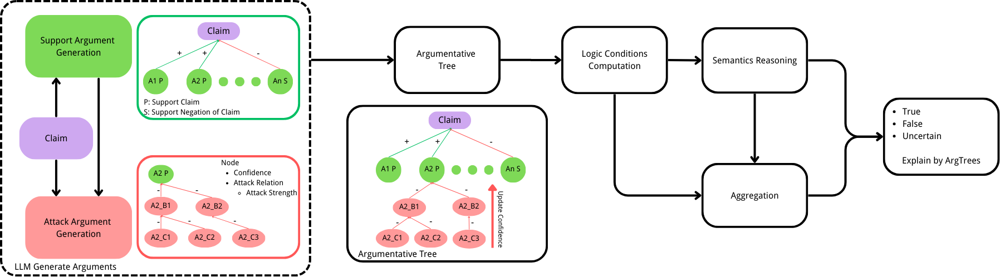
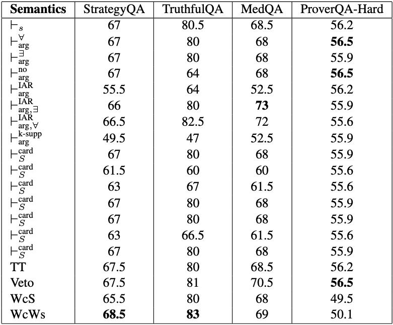

# LOGA

LOGA: **LOG**ical **A**rgumentation Framework for LLMs 

The task of this project is **Claim Verification**.

---

## Getting Started

After installing all required packages:

### Quick Start

- Run `go.sh` to quickly launch the **WebUI**
- Run `run.sh` to perform experiments on a **new dataset**

---

## WebUI

The left sidebar of the WebUI contains **three or four sections**:

- **Page** – Select different pages
- **LLM** – Select the LLM used in the WebUI
- **Dataset** – Select the dataset to visualize
- **Update Choice** – Select the confidence update strategy

---

### Page - DemoSingle

Visualizes all information for a **single Claim**, including:

- Condition Results
- Semantic Results
- ART Forest

Users can:

- Create a new claim to verify and generate semantic reasoning results
- Visualize the results of an existing claim

Each tree can be expanded to show its full structure, including:

- ID
- Status
- Confidence
- Argument

---

### Page - Evaluation

Visualizes the **overall results of a dataset**.

Users can switch between different **Update Choices** to observe how different **confidence update strategies** affect the results.

---

### Page - CV

Displays results of **cross-validation experiments** across different datasets.

Experimental results show that **Aggregation remains stable when incorporating results from other datasets**.

---

## `Data` Folder

All datasets are stored in `./data` as folders.

Each dataset contains:

- `res_{NUM}`: `{NUM}` indicates the **{NUM}-th experiment run**

Inside this folder:

- `{ID}.json`  
  ID corresponds to the ID in `data.json`

- `Cond_7` Folder 
  Verification results for **Condition 7**

- `MC` Folder  
  Verifies whether arguments are **incoherent or inconsistent under the claim context**.  
  If such a case exists → `1`, otherwise → `0`.

  - `{ID}.json`  
    ID corresponds to the ID in `data.json`

- `veri_set` Folder   
  Verifies whether a **set of arguments is Consistent and Coherent with the Claim**
  
  - `{ID}` Folder
  
    - `{SET INDEX}.txt`
  
      `INDEX` indicates the index of a set within a claim.
  
- `data.json`
  
  Dataset content stored as a **JSON list**:
  
  ```json
  {
    "id": dataset ID,
    "claim": claim text,
    "label": Boolean
  }
  ```

## `Configs - Prompts` Folder

+ `support_yaml_prompt.txt`
     Prompt used to generate **Level-A Arguments**
+ `attack_yaml_prompt.txt`
     Prompt used to generate the **entire ART tree** from Level-A arguments

### Conds

Prompts used for specific **Conditions**:

+ `Base.txt`
     Base prompt used as an additional instruction for conditions
+ `{C7,C8,C9,C11}.txt`
     Individual prompts for four conditions
+ `MC.txt`
     Prompt used to compute **MC(O)** by checking pairwise argument relations for **inconsistency or incoherence**
+ `veri_sets.txt`
     Prompt used to verify whether a **set of arguments is consistent and coherent with the claim**


## Result

This directory stores the **best single-run results for several datasets**.

These results are used to compute the **Aggregation methods**:`Weighted Condition - Semantic` and `Weighted Condition - Weighted Semantic`


## Full Pipeline




## Experiment Result

